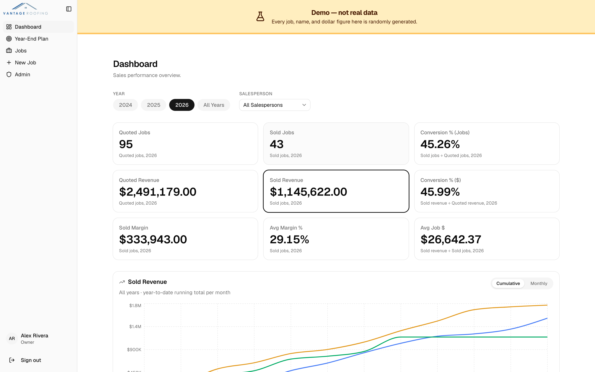
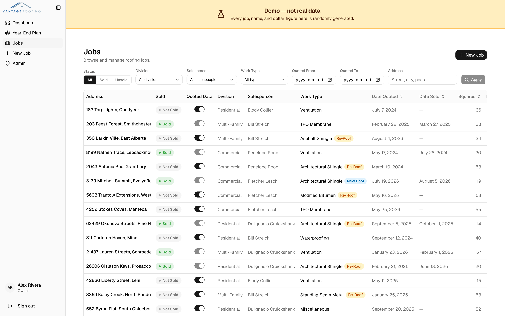
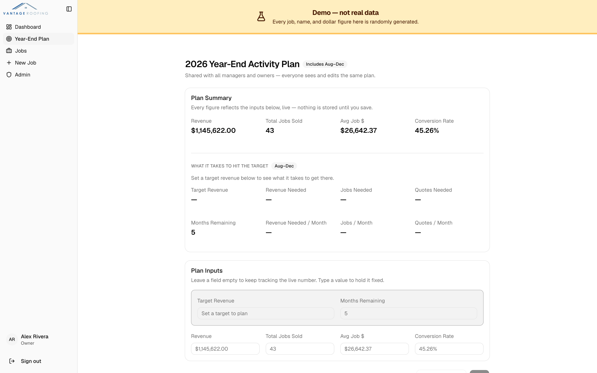
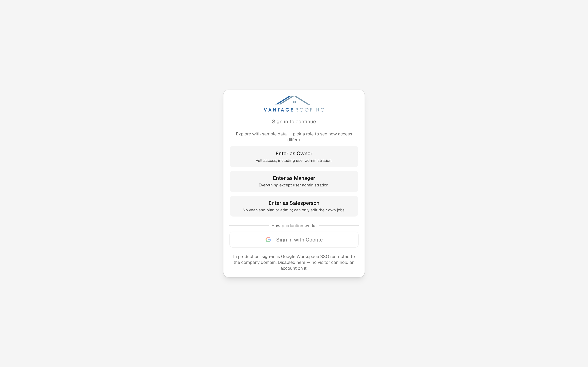

# Vantage Roofing — Sales Tracker

[](https://github.com/vikramsodhan/Vantage-Roofing-Project-Demo/actions/workflows/ci.yml)

A quoting and sales-tracking app built for Vantage Roofing, a roofing contractor that was running
its entire sales pipeline out of one shared spreadsheet. Salespeople log
quotes and sold jobs; managers and owners get a metrics dashboard and a year-end planner that
back-solves how much quoting activity is needed to hit a revenue target.

Designed, built, and shipped solo — schema, auth model, test suite, and CI.

> **A note on the commit history.** This repo is a public snapshot, squashed from the private
> production repository once the app was already running. The incremental history — branches,
> pull requests, and review — lives there. What you see here is the code, not the archaeology.

### **[▶ Open the live demo](https://vantage-roofing-project-demo.vercel.app)**

No signup. Pick a role at the door — **Owner**, **Manager**, or **Salesperson** — and the app changes
around you: navigation, page access, and what the database will hand back all differ. Every figure
you'll see is randomly generated.



---

## What it does

- **Job pipeline** — quotes and sold jobs with cost breakdowns, margins, filtering, and pagination
  over hundreds of records
- **Metrics dashboard** — quoted vs. sold counts and revenue, conversion rates, margin, and
  year-over-year comparisons, filterable by year and salesperson
- **Year-End Activity Plan** — enter a revenue target and the page back-solves the jobs and quotes
  required, plus the monthly pace that implies
- **Role-based access** — salesperson, manager, and owner, enforced from the UI down to the database
- **Admin** — user roles, account activation, and the work-type catalogue

<details>
<summary><b>More screenshots</b></summary>

**Jobs** — filtering, sorting, pagination



**Year-End Activity Plan** — live figures with sparse manual overrides



**Sign-in** — the demo's role picker, alongside the Google SSO production actually uses



</details>

---

## Engineering notes

The parts worth a developer's attention.

### Permissions are enforced in four independent places

Hiding a nav link is not access control. Every gated capability is checked at four layers, and the
last two are the ones that matter:

1. **Navigation** — the link isn't rendered
2. **Page** — a server-side redirect if you type the URL anyway
3. **Server action** — a role check inside the mutation, because a server action is a public
   endpoint and a disabled button doesn't stop anyone invoking it
4. **Row Level Security** — Postgres policies, so even a hand-rolled API call with a valid session
   only sees rows that user is entitled to

Two of the Playwright tests deliberately skip the browser entirely and hit Supabase directly with a
signed-in client, because driving the UI can only ever prove a button is hidden — never what happens
when someone bypasses it.

### A latent production bug the test data surfaced

The dashboard fetched every job in one unbounded query. PostgREST silently caps result sets at its
project-level "Max rows" setting (default 1000), so past a thousand jobs **every metric on the page
would quietly have been wrong** — no error, just smaller numbers. It surfaced only when a cloned
database showed roughly half the expected revenue.

The fix pages through in fixed batches so the result no longer depends on a setting that lives
outside the schema and doesn't travel with a database dump. See
[`dashboardJobs.ts`](src/lib/dashboardJobs.ts).

### Deterministic seed data

[`scripts/seed.ts`](scripts/seed.ts) generates ~400 jobs across three calendar years from a fixed
faker seed, so end-to-end assertions stay stable run to run. The date window is anchored to the
clock rather than fixed dates — a hardcoded range would have left the current year empty the moment
it rolled over, and the year-end planner reads exactly that year.

Job generation is shared with the demo's reset script so both produce byte-identical data; a
[test](scripts/demoData.test.ts) parses `supabase/seed.sql` and fails if the reference data drifts
from its TypeScript source of truth.

### Making a public demo safe to leave running

Every visitor signs in as a real role, so anything reachable is breakable — jobs, the shared plan,
the work-type catalogue, even other people's roles. A nightly GitHub Action restores all of it.

It deliberately **doesn't** touch `auth.users`: deleting those would sign out anyone mid-visit, so
roles are repaired with an update instead. It also refuses to run against any database containing
accounts outside the seeded set, so a stale credential fails safe rather than wiping something real.

### Testing

**138 unit tests** covering the metrics registry, permission predicates, form schemas, formatters,
and the year-end maths — pure functions, no database or browser.

**15 Playwright flows** against a real Supabase instance: login, job creation, the full role-access
matrix, and the year-end planner's override behaviour.

CI runs lint, typecheck, format, unit tests, and a production build, then boots Supabase in a second
job for the end-to-end suite.

---

## Stack

Next.js 16 (App Router) · TypeScript · Supabase (Postgres + RLS) · Tailwind + shadcn/ui ·
react-hook-form + zod · Mapbox · Vitest + Playwright · Vercel · GitHub Actions

Roughly 10,700 lines of TypeScript across 107 files.

## Running it locally

Requires Node 22, the [Supabase CLI](https://supabase.com/docs/guides/cli), and a running Docker
daemon — `supabase start` brings up Postgres, Auth, and the API as containers. Docker Desktop,
Colima, and OrbStack all work.

```bash
git clone https://github.com/vikramsodhan/Vantage-Roofing-Project-Demo.git
cd Vantage-Roofing-Project-Demo
npm install

cp .env.example .env.local
cp scripts/.env.example scripts/.env.local

supabase start    # Postgres + Auth + API, applies migrations and reference data
npm run db:seed   # deterministic test data — 7 users, ~400 jobs
npm run dev
```

`supabase start` prints the local API URL and keys — put those in `.env.local`, and set
`NEXT_PUBLIC_DEMO_MODE=true` to get the role picker.

| Command              | What it does                                      |
| -------------------- | ------------------------------------------------- |
| `npm run dev`        | Start the dev server                              |
| `npm run build`      | Production build                                  |
| `npm run lint`       | ESLint                                            |
| `npm run typecheck`  | `tsc --noEmit`                                    |
| `npm run test`       | Vitest, once                                      |
| `npm run test:e2e`   | Playwright (needs Supabase running and seeded)    |
| `npm run db:seed`    | Seed a local instance with test data              |
| `npm run demo:reset` | Restore the demo's data, preserving auth accounts |
| `npm run format`     | Prettier — write                                  |

Two things to know before running the end-to-end suite:

- It needs a local Supabase instance, and **no dev server on port 3000** — Playwright reuses an
  existing one, which may be pointed at a different database.
- Locally it drives system-installed **Microsoft Edge**, because Playwright's bundled Chromium
  can't install on macOS 13. Set `PLAYWRIGHT_CHANNEL=chrome` to use Chrome instead. CI has no such
  constraint and installs Chromium normally.

## Documentation

- **[ARCHITECTURE.md](docs/ARCHITECTURE.md)** — routes, data model, server actions, auth flow
- **[DESIGN.md](docs/DESIGN.md)** — why the auth model, metrics registry, and year-end planner work
  the way they do

## About this demo

This is a public snapshot of a production application, deployed against a throwaway database.
**Every job, name, address, and dollar figure is randomly generated** — no real customer or business
data appears anywhere in this repository or its history. Published with the client's permission.

This demo's deploy pipeline ([`deploy.yml`](.github/workflows/deploy.yml)) follows the same idea
production uses — nothing deploys until [`ci.yml`](.github/workflows/ci.yml) has actually passed —
implemented separately here rather than shared. Some of the production setup is deliberately not
part of this snapshot, though: the operational handover runbook, and a nightly database backup job
that commits logical dumps to a separate private repository.

The demo resets nightly, so feel free to change things.
